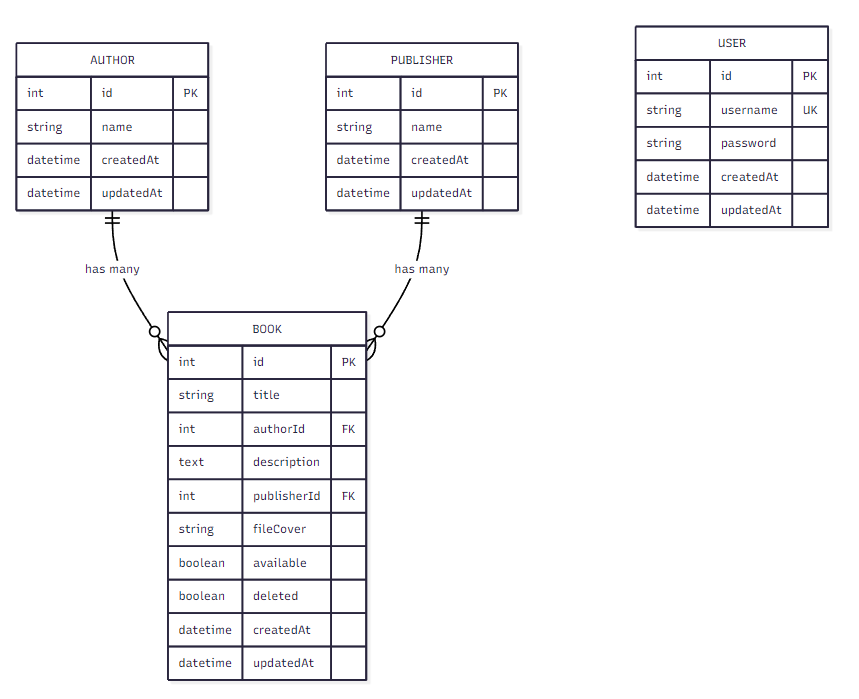
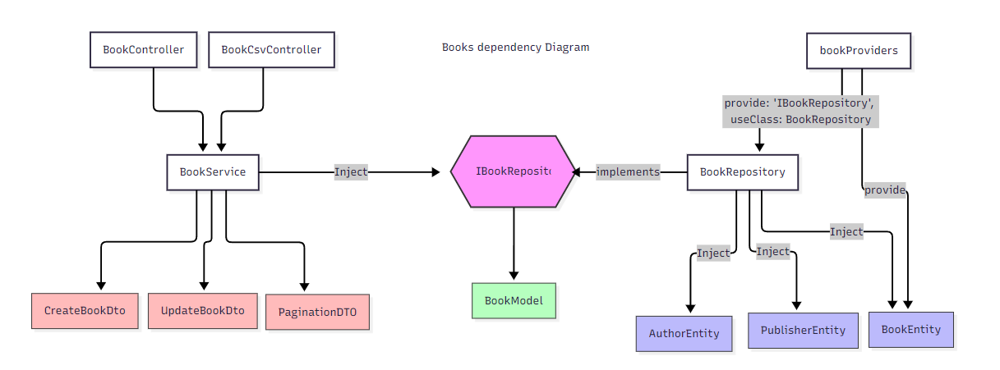

# LibraryApp

A web application for managing a library's book collection.

## Setup & Installation

- Run `docker-compose up -d`

## Usage

- Open `http://localhost:3000/`
- Login with:
  - Username: user
  - Password: pass

## Customization

### Change or Add Users
- Modify `user.seeder.ts`

### Change or Add Books
- Modify `books.json`
- Reset the database

## To Do
- Tests covering everything
- Image uploader
- DB Indexation

## Design Decisions

### Normalization
As requirements state, the database must be normalized, so it is. However, the most optimized approach would be to denormalize it and switch to a document-based DB.

The other layers handle the data in a denormalized format as they should.

### Architecture
NestJS is a very opinionated framework that helps follow SOLID principles. The only exception is the implementation of ORMs where it's vital to decouple them from the main domain.

### Deployment
The frontend was merged with NestJS on deployment to make it easier to use without the need to configure endpoints and cross-origin policies.

### Style
It was inspired by [A Dark Room](https://adarkroom.doublespeakgames.com/)