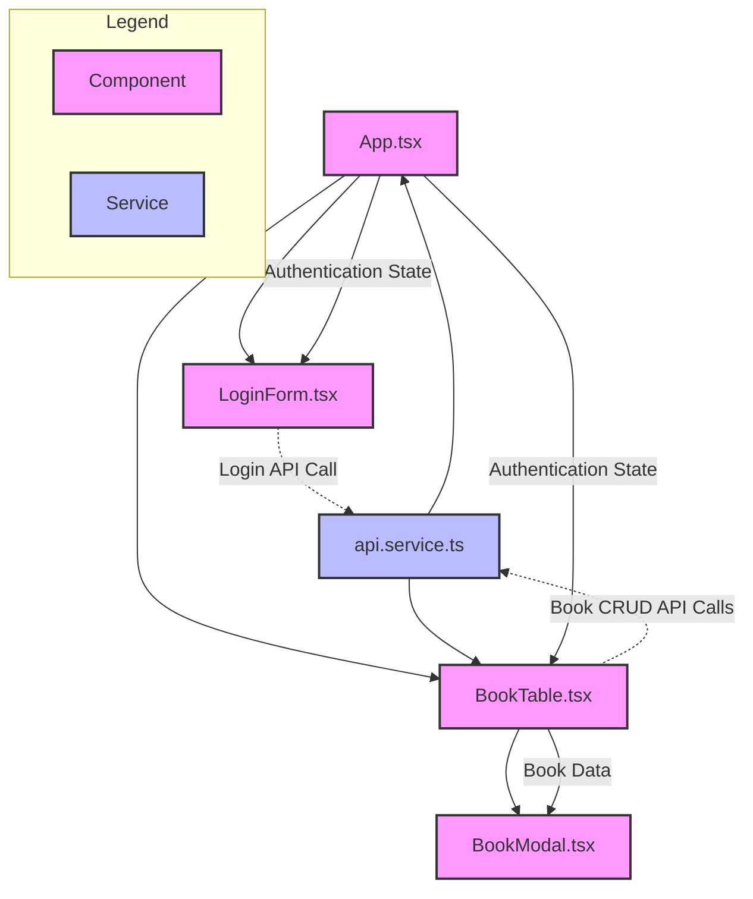

## Component Structure

- **App.tsx**: Main application component that manages authentication state
- **LoginForm.tsx**: Handles user login form and authentication
- **BookTable.tsx**: Displays books with pagination, sorting, and search
- **BookModal.tsx**: Modal for adding/editing book details

## Service Structure

- **api.service.ts**: Core API service handling HTTP requests, authentication, and book operations

## Data Flow

1. User logs in via LoginForm
2. Authentication token stored in api.service
3. App switches to BookTable view
4. BookTable fetches books from api.service
5. Book operations (add/edit/delete) flow through api.service